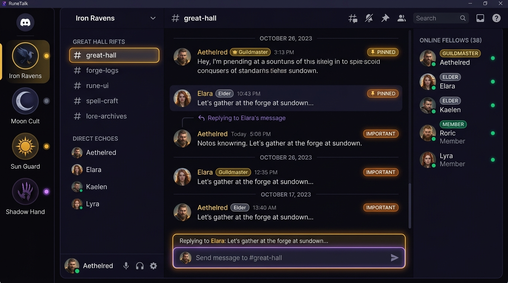
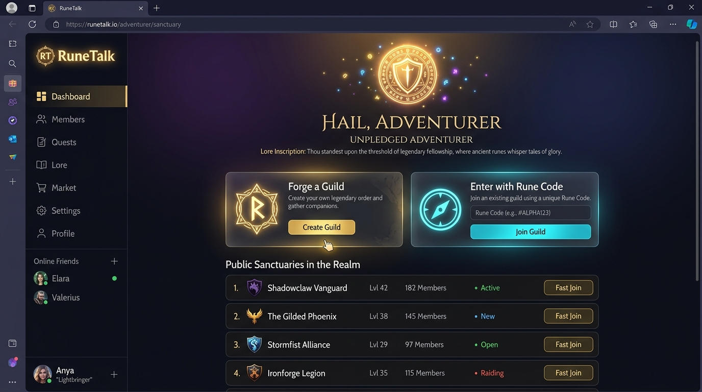

# RuneTalk

A modern, dark-fantasy real-time chat platform engineered with Rust (Axum) and React (TypeScript + Vite + Tailwind CSS). RuneTalk features dynamic guilds, sacred rift channels, real-time message echoes, direct scroll whispers, presence tracking, and arcane authorization.

---

## Visual Previews

### Main Chamber & Sacred Rifts


### Unpledged Adventurer Sanctuary & Onboarding


---

## Core Features

- **Dynamic Adventurer Authentication** — Registration, JWT sessions, and 6-digit verification codes.
- **Unpledged Onboarding & Guild Sanctuaries** — New adventurers start unpledged with a fantasy welcome greeting to forge or join guilds with 8-character invite codes.
- **Sacred Rifts (Channels)** — Categorized text and voice rifts with topics, ordering, and channel permissions.
- **Real-Time Echoes & Message Actions** — Real-time chat messages with reply quotes, pinned echo banners, copy actions, and author role badges.
- **Direct Scrolls & Whispers** — Private 1-on-1 conversations between adventurers with unread tracking and instant switching.
- **Allies & Friendship Pledges** — Social hub for managing online allies, summoning new companions, and responding to pending pledges.
- **Adventurer Presence & Custom Statuses** — Glowing status rings for Online, Idle, Do Not Disturb, and Offline states, complete with custom status tags.
- **Real-Time Dual Architecture** — Interactive messaging over WebSockets (`/ws`) and reactive event feeds over Server-Sent Events (`/sse/friends`, `/sse/messages`).
- **GraphQL Schema** — Strongly-typed GraphQL API (`/graphql`) powered by `async-graphql` for querying guild hierarchies, channels, and member rosters.
- **Modern Responsive Design System** — Dark OLED Obsidian (`#09080e`), Astral Slate (`#0d0a18`), Rune Gold (`#d4af37`), and Mystic Violet accents with Cinzel serif and Plus Jakarta Sans typography.

---

## Tech Stack

| Layer | Technology | Purpose |
|---|---|---|
| **Backend Framework** | [Rust](https://www.rust-lang.org/) + [Axum 0.8](https://github.com/tokio-rs/axum) | High-performance asynchronous HTTP and WebSocket backend |
| **Frontend Framework** | [React 18](https://react.dev/) + [Vite 6](https://vite.dev/) + [TypeScript](https://www.typescriptlang.org/) | Fast, modular component architecture with strict typing |
| **Styling & Design System** | [Tailwind CSS](https://tailwindcss.com/) + [Lucide Icons](https://lucide.dev/) | Dark OLED fantasy theme and clean SVG iconography |
| **Database** | [PostgreSQL 16](https://www.postgresql.org/) | Relational database with full ACID compliance and indexes |
| **Persistence / Migrations** | [SQLx 0.9](https://github.com/launchbadge/sqlx) | Pure async SQL toolkit with compile-time query verification |
| **In-Memory Cache & Session** | [Redis](https://redis.io/) | OTP caching, presence snapshots, and ephemeral state |
| **Real-Time Streaming** | WebSocket + Server-Sent Events (SSE) | Bi-directional messaging and event subscriptions |
| **Query Layer** | [Async-GraphQL](https://async-graphql.github.io/async-graphql/) | Graph query interface for guilds and channel structures |
| **Cryptography & Auth** | Argon2 + JSON Web Tokens (JWT) | Secure password hashing and stateless token issuance |
| **Containerization** | Docker & Docker Compose | 1-command local development infrastructure |

---

## Database Architecture

| Table | Description |
|---|---|
| `adventurers` | User identity, email, hashed credentials, bio, and verification state |
| `guilds` | Orders, communities, descriptions, and 8-character invite codes |
| `guild_members` | Guild membership and role authorization (`owner`, `admin`, `member`) |
| `rifts` | Sacred communication chambers and channels inside guilds |
| `echoes` | Messages sent in rifts with reply hierarchies and pin states |
| `scrolls` | Direct 1-on-1 private messaging channels between two adventurers |
| `whispers` | Private messages transmitted within an active scroll |
| `presence` | Live status tracking (`online`, `idle`, `dnd`, `offline`) and custom tags |
| `allies` | Confirmed friendship connections between adventurers |
| `pledges` | Pending and historical friendship requests (`pending`, `accepted`, `rejected`) |

---

## Getting Started

### Prerequisites

- [Docker & Docker Compose](https://www.docker.com/) (recommended for instant local infrastructure)
- [Rust](https://www.rust-lang.org/) (1.75+ or stable toolchain)
- [Node.js](https://nodejs.org/) (v18+ or v20+) & `npm`

---

### 1. Start Local Database & Redis (Docker Compose)

From the project root:

```bash
docker compose up -d
```

This boots PostgreSQL 16 (Port 5432) and Redis (Port 6379) in the background.

---

### 2. Start the Rust Backend

```bash
cd be-rust

# Copy configuration (already pre-configured for local Docker)
cp config/config.example.yaml config/config.yaml

# Run the automated backend test suite (90 unit and integration tests)
cargo test

# Run the backend server
cargo run
```

The Axum backend will listen on `http://127.0.0.1:8080`.

---

### 3. Start the Frontend UI

In a separate terminal:

```bash
cd frontend

# Install dependencies
npm install

# Start the Vite development server
npm run dev
```

Open **`http://localhost:3000`** in your browser to explore the application:
1. **Register** a new adventurer account and verify with the generated code.
2. Experience the **Welcome Sanctuary** greeting for unpledged characters.
3. **Forge a Guild** or redeem invite codes (`FORGE-7K`, `ASTRA-2Q`) to unlock rifts.
4. Send echoes, quote replies, toggle pins, and manage presence states.

To create a production build of the frontend:

```bash
cd frontend
npm run build
```

---

## API Documentation

Comprehensive REST, WebSocket, SSE, and GraphQL documentation is available at [docs/api/be-api.md](docs/api/be-api.md).

---

## License

This project is licensed under the MIT License.
