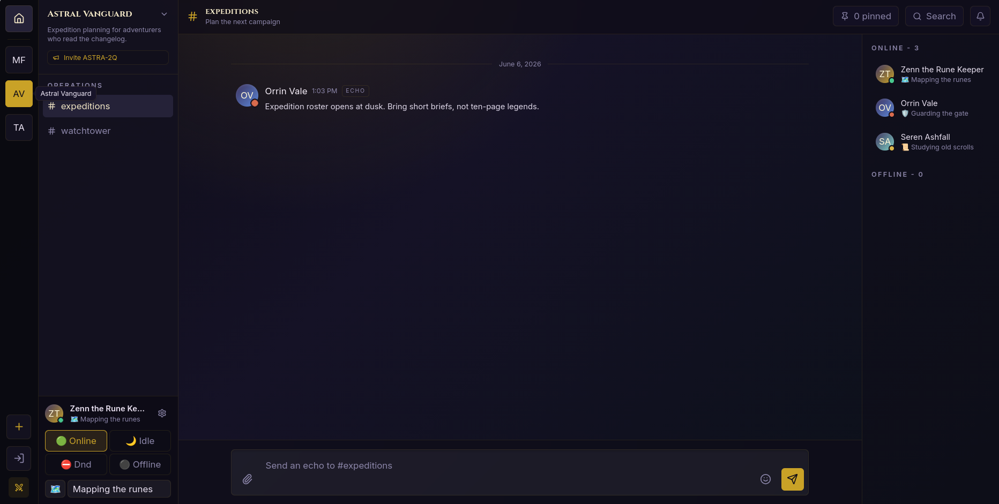

# RuneTalk

A fantasy-themed real-time chat platform with guilds, adventurers, channels, and direct messaging.

## UI Preview



## Features

- **Authentication** — Register and login with JWT, OTP verification via SMTP email
- **Guilds** — Create and manage guilds with roles (owner, admin, member)
- **Rifts** — Text and voice channels inside guilds with topic and ordering
- **Echoes** — Real-time messages in rifts with reply support
- **Scrolls & Whispers** — Private direct messaging conversations between adventurers
- **Presence** — Online, offline, idle, and do-not-disturb status tracking
- **Real-time** — WebSocket for interactive messaging, Server-Sent Events (SSE) for event streaming
- **GraphQL** — Query guild hierarchies, channel structures, and member lists
- **Frontend UI** — React and Tailwind interface for guilds, channels, DMs, allies, modals, and presence states

## Tech Stack

| Layer | Technology |
|---|---|
| Language | Rust |
| Web Framework | Axum 0.8 |
| Frontend | React 18 + Vite + Tailwind CSS |
| Database | PostgreSQL 16 |
| Cache / Session | Redis |
| ORM / Migrations | SQLx 0.9 |
| Auth | JWT + Argon2 + OTP |
| Email | SMTP (Lettre) |
| Real-time | WebSocket + SSE |
| API | REST + GraphQL (Async-GraphQL) |
| Validation | validator |
| Logging | tracing + tracing-subscriber |

## Database Schema

| Table | Description |
|---|---|
| `adventurers` | User accounts |
| `guilds` | Servers and communities |
| `guild_members` | Server membership and roles |
| `rifts` | Text channels inside guilds |
| `echoes` | Messages inside rifts |
| `scrolls` | Direct message conversations between two adventurers |
| `whispers` | Messages inside a scroll (direct message) |
| `presence` | Online status per adventurer |
| `allies` | Friend relationships |
| `pledges` | Friend requests and status |

## Getting Started

### Prerequisites

- Rust (1.75+ or stable)
- PostgreSQL 16
- Redis
- SQLx CLI (optional, for manual migration management)

```bash
cargo install sqlx-cli --no-default-features --features rustls,postgres
```

### Backend Setup

```bash
# Clone the repository
git clone https://github.com/yourusername/RuneTalk.git
cd RuneTalk/be-rust

# Create configuration from example
cp config/config.example.yaml config/config.yaml

# Run tests
cargo test

# Run the backend server
cargo run
```

### Frontend UI

```bash
cd frontend
npm install
npm run dev
```

The frontend uses schema-shaped mock data in `frontend/src/app/data/mock.ts` and can run independently for interface testing.

## Documentation

API documentation is available at [docs/api/be-api.md](docs/api/be-api.md). It covers authentication, user and friendship management, guilds and rifts, WebSockets, Server-Sent Events (SSE), and GraphQL interfaces.

## License

MIT
